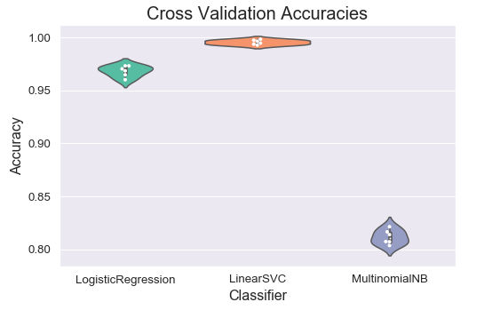
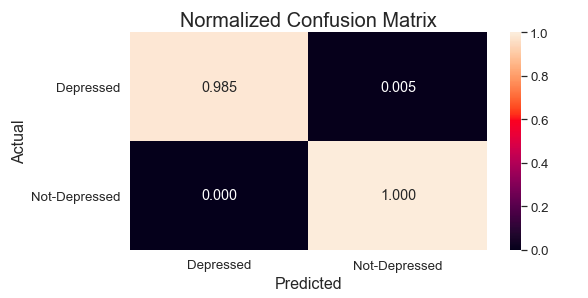
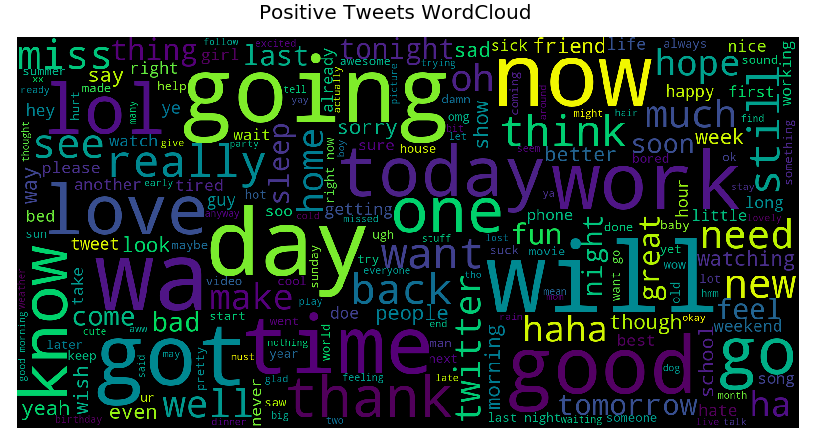
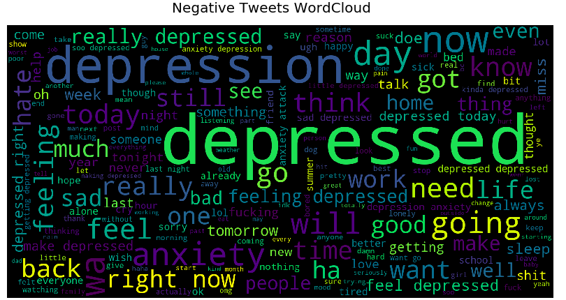
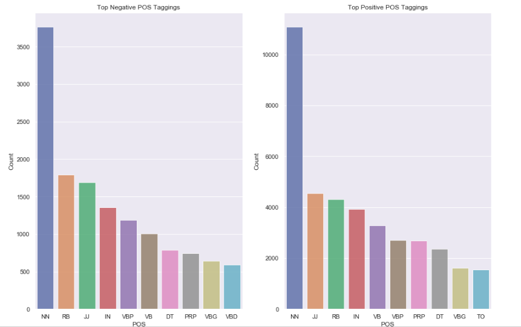

# Depression Detection in Tweets
## Overview
The project is based on Sentiment Analysis. Sentiment Analysis is used to classify text to a class. This project is an example of binary classification which classifies whether the twitter user is depressed based on a tweet post. It utilizes a statistical technique called TF-IDF (Term frequency-Inverse Document frequency) that evaluates how relevant a word is to a document(sentence) in a corpus(collection of documents). 
. Various Machine Learning algorithms are employed to construct a classifier.The Linear SVM achieved the highest accuracy
of 99.6% on test set.

## Dataset
The dataset is compiled from sentiment140 dataset and tweets scrapped using twint tool. Twint tool is an advanced twitter scraping tool that allows for 
tweets scraping from twitter profiles. It can also be used to scrap tweets using keyword search. After compiling the dataset , the dataset was manually filtered to remove 
redundant tweets.

The tweets can be scrapped using the following command

```
twint -s [keyword] --since [Date] -o [filename.csv] --csv
```
## Results and Visualization
<p align="center">
  
</p>
<b/>
<b/>
<p align="center">
  
</p>
<b/>
<b/>
<p align="center">
  
</p>
<b/>
<b/>
<p align="center">
  
</p>
<b/>
<b/>
<p align="center">
  
</p>


## References
for more information on twint commands, refer to [this page](https://jakecreps.com/2019/06/25/twint/)

https://www.kaggle.com/kazanova/sentiment140
